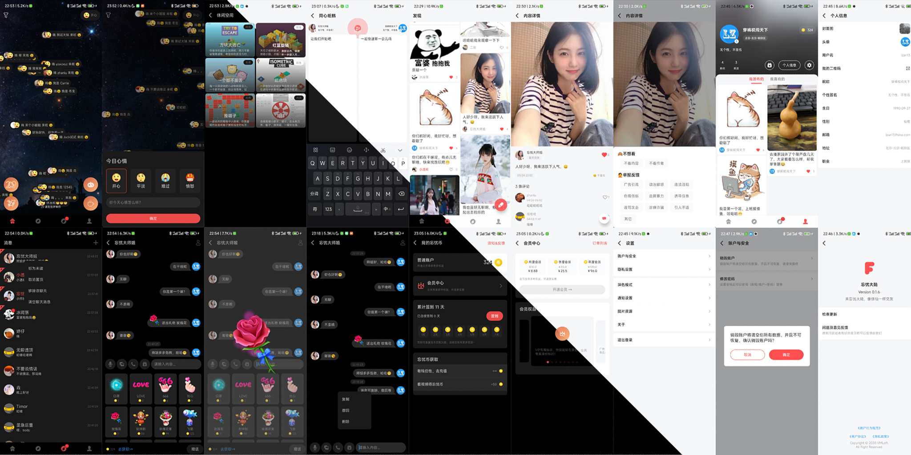

VMTemplateAndroid
=======

来忘忧大陆，修仙一样交友

分担忧愁，让烦恼减半
分享快乐，让乐趣加倍

帮助用户解决烦恼，忘记忧愁，放松心情，快乐交友等打造一站式社交平台，弹幕式心情分享，及新颖的即时聊天方式，带给用户不一样的交流体验，让用户之间的交流充满趣味性，提高心情愉悦度，达到忘记烦恼的目的。

【特色功能】绑定设备快速登录，无需复杂的各种验证（换设备前记得设置账户密码）
【特色功能】弹幕式心情匹配，让你乐趣翻倍
【特色功能】同心纸快速聊天，让你试试看到对方的想法
【特色功能】波浪式语音消息，看着就优美
【特色功能】特效礼物随心发，全屏播放礼物特效，告别平庸
【特色功能】语音变声通话，保护的声音隐私
【特色功能】休闲空间玩下小游戏，放松身心，换换心情

【贴心功能】防骚扰，聊熟了才能收发语音图片消息和语音呼叫
【贴心功能】内容不适？反手就是一个举报
【贴心功能】被骚扰了，直接拉黑他
【贴心功能】完整适配夜间模式，让你深夜刷手机聊天也不会刺眼

【更多功能】开发者正在被产品压榨加班中😭

如果有什么问题，可以通过【我的->设置->关于->问题及意见反馈】

    

### 开发环境

项目基本属于在`Android`开发环境下开发，全局使用`Kotlin`语言，项目已经适配`Android6.x`以上的动态权限适配，以及`7.x`的文件选择，和`8.x`的通知提醒，`10.x`的文件选择等；

- 开发系统：Mac OS 11.5.2
- 开发工具：Android Studio Arctic Fox | 2021.2.1
- 打包工具：Gradle 7.0.2
- 开发语言：Kotlin 1.5.21

### 项目模块儿

- `app` 主模块，包扩项目的业务逻辑
- `vmads` 广告模块，对广告请求与展示进行简单封装
- `vmbase` 基类模块，项目的基类封装
- `vmcommon` 公共模块，这部分主要包含了一些公共组件加配置信息
- `vmdata` 数据模块，包括网络请求的数据已经数据库缓存数据处理
- `vmdb` 数据库模块
- `vmgift` 礼物模块
- `vmim` IM模块，包括IM和通话部分，这是为了方便大家引用到自己的项目中做的一步封装，不用再去复杂的复制代码和资源等，只需要将`vmim`以`module`形式导入到自己的项目中就行了，具体使用方式参见项目`app`模块儿；
- `vmimage` 图片模块，包括图片选择、加载、浏览等
- `vmmp` 小程序模块
- `vmmqtt` MQTT模块 对mqtt链接与收发消息进行简单封装
- `vmpay` 支付模块
- `vmpush` 推送模块
- `vmqr` 二维码模块 二维码扫描识别与生成处理
- `vmreport` 统计模块 包括数据统计及bug上报
- `vmrequest` 网络请求模块

### 功能与 TODO

**IM部分功能**

- [x] 登录注册（由APP业务层调用）
- [x] 链接监听
- [x] 会话功能
    - [x] 置顶
    - [x] 标为未读
    - [x] 删除与清空
    - [x] 草稿功能
- [x] 聊天功能
    - [x] 消息类型
    - [x] 文本消息
    - [x] 通话消息
    - [x] 礼物消息
        - [x] 播放礼物动效
    - [x] 语音消息
    - [x] 图片消息
        - [x] 查看大图
        - [x] 保存图片
    - [x] 消息操作
        - [x] 删除
        - [x] 撤回
        - [x] 复制（仅文本可复制）
        - [x] 语音播放
        - [x] 查看大图
        - [x] 播放礼物特效
        - [x] 昵称头像处理
        - [x] 头像点击（回调到 App 层）
- [x] 语音实时通话功能
    - [x] 1V1音频通话
    - [x] 静音、扬声器播放
    - [x] 音效变声
- [x] 解忧茶室
    - [x] 创建房间
    - [x] 发送消息
        - [x] 文本消息
        - [x] 礼物消息
    - [x] 上下麦处理
    - [x] 音效变声

**App部分功能**

- [x] 登录注册（包括业务逻辑和 IM 逻辑）
- [x] 首页
    - [x] 修改心情
    - [x] 获取他人心情弹幕
    - [x] 实时接收他人最新心情
    - [x] 心情匹配
    - [x] 同心纸鹤
    - [x] 休闲空间
    - [x] 解忧聊天室
- [x] 发现
    - [x] 发布内容
    - [x] 喜欢操作
    - [x] 屏蔽举报
    - [x] 详情展示
        - [x] 屏蔽举报
        - [x] 喜欢操作
        - [x] 评论获取
        - [x] 添加评论
- [x] 聊天（这里直接加载 IM 模块儿）
- [x] 我的
    - [x] 个人信息展示
    - [x] 上传头像、封面
    - [x] 设置昵称、签名、职业、地址、生日、性别等
    - [x] 邮箱绑定
    - [x] 个人发布与喜欢内容展示
    - [x] 我的礼物
- [x] 积分签到
    - [x] 会员身份
    - [x] 忘忧币充值
- [x] 设置
    - [x] 账户与安全
        - [x] 注销账户
        - [x] 修改密码
    - [x] 隐私设置
        - [x] 陌生人私信开关
        - [x] 黑名单列表
    - [x] 深色模式
    - [x] 通知设置
    - [x] 资源加载设置
    - [x] 关于
        - [x] Debug模式
        - [x] 检查更新
        - [x] 问题反馈
        - [x] 用户行为规范
        - [x] 用户协议
        - [x] 隐私政策
    - [x] 退出登录

**发布功能**

- [x] 多渠道打包
- [x] 签名配置
- [x] 开发与线上环境配置
- [x] 敏感信息保护

### 配置运行

1. 首先复制`config.default.gradle`到`config.gradle`
2. 配置下`config.gradle`内相关字段
3. 正式打包需要自己生成签名文件，然后修改下`config.gradle`的`signings`签名信息
4. 需配合服务器端一起使用，修改上边`config.gradle`配置文件的`baseDebugUrl`和`baseReleaseUrl`

### 参与贡献

如果你有什么好的想法，或者好的实现，可以通过下边的步骤参与进来，让我们一起把这个项目做得更好，欢迎参与 😁

1. `Fork`本仓库
2. 新建`feature_xxx`分支 (单独创建一个实现你自己想法的分支)
3. 提交代码
4. 新建`Pull Request`
5. 等待`Review & Merge`

### 更多

**项目客户端下载体验**

- [本地 APK 包下载](http://app.melove.net/fwn)
- [GooglePlay 市场下载](https://play.google.com/store/apps/details?id=com.vmloft.develop.app.nepenthe)

**开源仓库地址**

- [gitee/VMTemplateAndroid](https://gitee.com/lzan13/VMTemplateAndroid) Android 客户端
- [gitee/vmtemplateadmin](https://gitee.com/lzan13/vmtemplateadmin) 管理端项目使用`vue3`+`vite`+`element-plus`
- [gitee/vmtemplatehome](https://gitee.com/lzan13/vmtemplatehome) 首页端项目使用`vue3`+`vite`
- [gitee/vmtemplateserver](https://gitee.com/lzan13/vmtemplateserver) 服务器端项目使用`eggjs`

**项目介绍说明**

- [Android 功能介绍](https://mp.weixin.qq.com/s/bZYNCkngSuYpYJfdwFFYlw)
- [服务器介绍说明](https://mp.weixin.qq.com/s/1D0VllcyolPL1ei7Ix9hfw)

- [更新记录](./UPDATE.md)

**沟通交流**
可以通过已下方式找到我，获取最新信息，以及技术支持

公众号: 穿裤衩闯天下

    

QQ 群: 901211985 个人 QQ: 1565176197

    
    

**支持赞助**

如果你觉得当前项目帮你节省了开发时间，想要支持赞助我的话 👍，可以扫描下方的二维码打赏请我吃个鸡腿 🍗，你的支持将鼓励我继续创作 👨‍💻‍，感谢 ☺️ [赞助列表](./sponsor.md)

    
    

### LICENSE

[MIT License Copyright (c) 2022 lzan13](./LICENSE)

